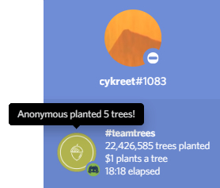

<h1>
  
  Treecord
</h1>

Discord <a href="https://teamtrees.org">teamtrees.org</a> rich presence built into a portable <a href="https://electronjs.org">Electron</a> application.

<i>(windows release only, compatibility with other operating systems is planned)</i>

[Download (Pre-Release)](https://github.com/cykreet/treecord/releases)

## Usage

Once downloaded, simply run the application and it should pop-up in your operating system's tray, it'll then attempt to connect to a Discord client and relay the latest information from teamtrees.org to the connected user's activity. From the tray context menu, you can view the application version, currently connected user and a button to terminate the application.

