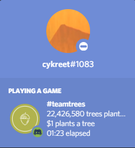
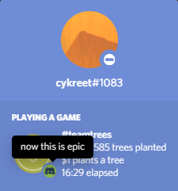

<h1 align="center">
  
   
  Treecord
   
</h1>

  <h4>
    Discord <a href="https://teamtrees.org">teamtrees.org</a> rich presence built into a portable
    <a href="https://www.electronjs.org">Electron</a> application.
  </h4>
  
  <a href="/releases">Download (Pre-Release)</a>

<i>(windows release only, compatibility with other operating systems is planned)</i>

  
  
  

## Usage

Once downloaded, simply run the application and it should pop-up in your operating system's tray, it'll then attempt to connect to a Discord client and relay the latest information from teamtrees.org to the connected user's activity. From the tray context menu, you can view the application version, currently connected user and a button to terminate the application.

